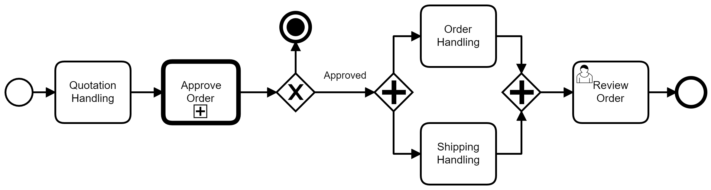

# UAI-Fly

 **Beatriz De Oliveira, beatrizdeoliveira45@hotmail.com** 

 **Henriqued Diniz , henriquesantanadiniz@gmail.com**

 **Maria Eduarda Chrispim, mariae.chrispims@gmail.com**
 
 **Matheus Pereira, Matheuspcsilva25@gmail.com**
 
 **Pedro Afonso, pedroafonso939@Yahoo.com.br**
 
 **Vitor Souza, vifersouza@gmail.com**

---

Professores:

**Cleiton Silva Tavares**

**Felipe Augusto Lima Reis**

**Hugo Bastos de Paula**

---

_Curso de Engenharia de Software, Unidade Praça da Liberdade_

_Instituto de Informática e Ciências Exatas – Pontifícia Universidade de Minas Gerais (PUC MINAS), Belo Horizonte – MG – Brasil_

---

_Nosso projeto tem como principal objetivo, auxiliar os clientes a encontrar as passagens e pacotes de viagem com o melhor custo benefício. A UAI-Fly possui os melhores valores de passagens aéreas e pacotes de viajem de mercado, nosso trabalho é agrupar o valor de várias passagens e apresentar ao nosso cliente diversos tipos de voos, tanto para classe econômica quanto para a classe executiva, filtrando os melhores preços de acordo com a data de ida e de volta do passageiro. Por fim mostraremos hotéis, pousadas, hostéis e muito mais lugares onde o cliente possa se hospedar, sempre seguindo os filtros definidos pelo mesmo e prezando pela qualidade e confiabilidade do local de hospedagem.

---

## 1. Introdução

    1.1 Contextualização
 Devido ao aumento do dólar, os preços de passagens aéreas e hospedagens subiram bastante, o que contribui para a diminuição de tráfego aéreo e perda no setor de turismo.  O aplicativo em desenvolvimento, vem para auxiliar as pessoas a comprarem pacotes de viagens, passagens aéreas avulsas e hospedagem com os melhores preços, assim ajudando as pessoas nas melhores escolhas.
 

    1.2 Problema

Notamos que o problema está na dificuldade de encontrar pacotes de viagens com preços baixos e também a desconfiança de escolher um local de hospedagem.

    1.3 Objetivo geral

É uma aplicação que busca contribuir para achar os melhores valores de passagens aéreas e confiabilidade de hospedagem. 

        1.3.1 Objetivos específicos
        
Nosso objetivo é agrupar o valor de várias passagens e apresentar ao usuário diversos opção de passagens, tanto para classe econômica quanto para a classe executiva, 
filtrando os melhores preços e lugares de confiança para se hospedar.

   
    1.4 Justificativas

Nosso grupo escolheu esse tema pelo motivo de ter poucas aplicações que buscam solucionar os problemas citados acima.

## 2. Participantes do processo

Em nossa aplicação teremos as seguintes entidades envolvidas: Empresa de aviação, na qual ofertará os melhores pacotes possíveis; Hotéis,pousadas, casas que irão fornecer um lugar de qualidade para serem alugados; Usuários que irão utilizar nosso aplicativo para essa intermediação.

## 3. Modelagem do processo de negócio

## 3.1. Análise da situação atual

Hoje, a internet disponibiliza diversas opções de compras de passagens e pacotes de viagens. Existem diversos sites e plataformas que realizam vendas terceirizadas, onde as ofertas saem mais baratas, porém deviado a terceirização a segurança na compra é considerávelmente afetada.

## 3.2. Descrição Geral da proposta

A proposta do " Uai-Fly " consiste na criação de um sistema que auxilia o usuário encontrar
as passagens aéreas, pacotes de viagem com o melhor custo e hospedagem confiáveis, assim
passando um conforto para o usuário da aplicação.

## 3.3. Modelagem dos Processos

### 3.3.1 Processo 1 – Login / Cadastro

Este Processo Mostra o sistema de login / cadastro solicitando o cartao de credito.

### 3.3.1 Processo 2 –  Bagagem / Despacho 

Este processo mostra com será o sistema de despacho de bagagens. / O despacho solicita o peso da bagagem.

### 3.3.1 Processo 3–  Compra passagem

Este processo mostra como será o processo da compra de passagens.

### 3.3.1 Processo 4–  Check-in

### 3.3.1 Processo 5 –  Cancelamento de passagens 
Este processo mostra como será o processo do cancelamento de passagens.

### 3.3.1 Processo 6 –  Avaliação dos serviços 

Este processo mostra como será realizado o processo de avaliação dos serviços oferecidos pelas empresas aéreas e de hospedagem.

### 3.3.2 Processo 2 – NOME DO PROCESSO

Apresente aqui o nome e as oportunidades de melhorias para o processo 2. Em seguida, apresente o modelo do processo 2, descrito no padrão BPMN.

## 4. Projeto da Solução

### 4.1. Detalhamento das atividades

Descrever aqui cada uma das propriedades das atividades de cada um dos processos. Devem estar relacionadas com o modelo de processo apresentado anteriormente.

#### Processo 1 – NOME DO PROCESSO

**Nome da atividade 1**

| **Campo** | **Tipo** | **Restrições** | **Valor default** |
| --- | --- | --- | --- |
| [Nome do campo] | [Área de texto, Caixa de texto, Número, Data, Imagem, Seleção única, Múltipla escolha, Arquivo, Link, Tabela] |  |  |
| ***Exemplo:***  |    |     |
| login | Caixa de Texto | formato de e-mail |  |
| senha | Caixa de Texto | mínimo de 8 caracteres |   |

**Nome da atividade 2**

| **Campo** | **Tipo** | **Restrições** | **Valor default** |
| --- | --- | --- | --- |
| [Nome do campo] | [Área de texto, Caixa de texto, Número, Data, Imagem, Seleção única, Múltipla escolha, Arquivo, Link, Tabela] |  |  |
|    |    |     |

#### Processo 2 – NOME DO PROCESSO

**Nome da atividade 1**

| **Campo** | **Tipo** | **Restrições** | **Valor default** |
| --- | --- | --- | --- |
| [Nome do campo] | [Área de texto, Caixa de texto, Número, Data, Imagem, Seleção única, Múltipla escolha, Arquivo, Link, Tabela] |  |  |
|    |    |     |

**Nome da atividade 2**

| **Campo** | **Tipo** | **Restrições** | **Valor default** |
| --- | --- | --- | --- |
| [Nome do campo] | [Área de texto, Caixa de texto, Número, Data, Imagem, Seleção única, Múltipla escolha, Arquivo, Link, Tabela] |  |  |
|    |    |     |

### 4.2. Tecnologias

Descreva qual(is) tecnologias você vai usar para resolver o seu problema, ou seja implementar a sua solução. Liste todas as tecnologias envolvidas, linguagens a serem utilizadas, serviços web, frameworks, bibliotecas, IDEs de desenvolvimento, e ferramentas. Apresente também uma figura explicando como as tecnologias estão relacionadas ou como uma interação do usuário com o sistema vai ser conduzida, por onde ela passa até retornar uma resposta ao usuário.

## 5. Modelo de dados

Apresente o modelo de dados por meio de um modelo relacional ou Diagrama de Entidade-Relacionamento (DER) que contemple todos conceitos e atributos apresentados item anterior. 

## 6. Indicadores de desempenho

Apresente aqui os principais indicadores de desempenho e algumas metas para o processo. Atenção: as informações necessárias para gerar os indicadores devem estar contempladas no diagrama de classe. Colocar no mínimo 5 indicadores.

Usar o seguinte modelo:

| **Indicador** | **Objetivos** | **Descrição** | **Cálculo** | **Fonte dados** | **Perspectiva** |
| --- | --- | --- | --- | --- | --- |
| Percentual reclamações | Avaliar quantitativamente as reclamações | Percentual de reclamações em relação ao total atendimento |   | Tabela reclamações | Aprendizado e Crescimento |
| Taxa de Requisições abertas | Melhorar a prestação de serviços medindo a porcentagem de requisições | Mede % de requisições atendidas na semana |  | Tabela solicitações | Processos internos |
| Taxa de entrega de material | Manter controle sobre os materiais que estão sendo entregues | Mede % de material entregue dentro do mês |   | Tabela Pedidos | Clientes |

Obs.: todas as informações para gerar os indicadores devem estar no diagrama de classe **a ser proposto**

## 7.Sistema desenvolvido

Faça aqui uma breve descrição do software e coloque as principais telas com uma explicação de como usar cada uma.

## 8. Conclusão

Apresente aqui a conclusão do seu trabalho. Discussão dos resultados obtidos no trabalho, onde se verifica as observações pessoais de cada aluno. Poderá também apresentar sugestões de novas linhas de estudo.

# REFERÊNCIAS

Como um projeto de software não requer revisão bibliográfica, a inclusão das referências não é obrigatória. No entanto, caso você deseje incluir referências relacionadas às tecnologias, padrões, ou metodologias que serão usadas no seu trabalho, relacione-as de acordo com a ABNT.

Verifique no link abaixo como devem ser as referências no padrão ABNT:

http://www.pucminas.br/imagedb/documento/DOC\_DSC\_NOME\_ARQUI20160217102425.pdf

**[1.1]** - _ELMASRI, Ramez; NAVATHE, Sham. **Sistemas de banco de dados**. 7. ed. São Paulo: Pearson, c2019. E-book. ISBN 9788543025001._

**[1.2]** - _COPPIN, Ben. **Inteligência artificial**. Rio de Janeiro, RJ: LTC, c2010. E-book. ISBN 978-85-216-2936-8._

**[1.3]** - _CORMEN, Thomas H. et al. **Algoritmos: teoria e prática**. Rio de Janeiro, RJ: Elsevier, Campus, c2012. xvi, 926 p. ISBN 9788535236996._

**[1.4]** - _SUTHERLAND, Jeffrey Victor. **Scrum: a arte de fazer o dobro do trabalho na metade do tempo**. 2. ed. rev. São Paulo, SP: Leya, 2016. 236, [4] p. ISBN 9788544104514._

**[1.5]** - _RUSSELL, Stuart J.; NORVIG, Peter. **Inteligência artificial**. Rio de Janeiro: Elsevier, c2013. xxi, 988 p. ISBN 9788535237016._

# APÊNDICES

**Colocar link:**

Do código (armazenado no repositório);

Dos artefatos (armazenado do repositório);

Da apresentação final (armazenado no repositório);

Do vídeo de apresentação (armazenado no repositório).

